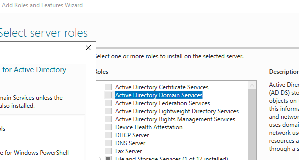
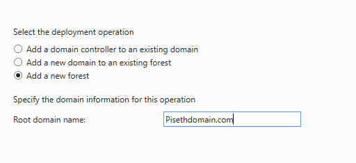
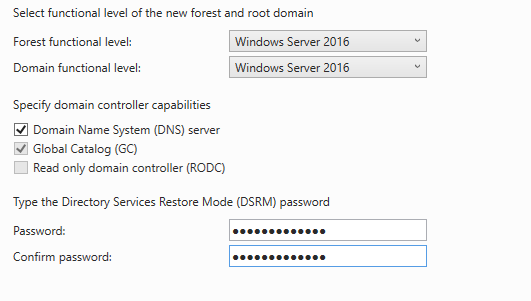

# Active-Directly-Lab
Active-Directly Lab using Azure VM

<h1>Step 1: Create Domain VM</h1>

Create a Domain Controller - This VM will be running on Windows Server 2022

1. Create Resource Group Name It- AD-LAB
2. Create VM01- Domain Controller (DC-1) - 2 CPU - with Window server 2022. Once the VM up and running, follow the next step
    - Make sure you make IP to STATIC :
    - On Azure search Virtual Machine, Click on VM you just created (DC-1)
    - Under "Setting" click on Networking tab-> Click on NIC(Network Interface Card)->IP configuration -> Click ipconfig1 -> Private IP address settings -> Dynamic to Static-> SAVE.

 <h2>Step 2: Create Cilent01 VM </h2>

1. Create VM01- Domain Controller - 2 CPU - with Window 10 Pro
2. Create a users - Note: write down the username and password
3. Make sure choose the correct resource group (example: AD-LAB-vnet)
4. Leave the subnet same and the rest are default
    - Make sure The Region of the DC-01 and Client-01  in the same region and resource group and Vnet ( Double check virtual network /subnet of both machine are the same).

<h2>Step 3: Allowed ICMP Protocol for both machine </h2>

- Log in to Client01 and ping <strong>Private IP Address </strong>DC-1 IP with -t(while loop ping ), (Example: ping -t ping -t 10.1.0.4)
- Log in DC-1 : Search wf.msc ( window firewall)
    - Click on Inbound Rule - Enable - ICMP echo Request IPV4
    
- Check Client-1 cmd - You will see ping is now working. 

<h2>Step 4: Install Domain Services on DC-1 machine </h2>
    - On Windows server - click "Add Roles adn Features"

    - Once AD services installed - Click on the Flag upper right corner of the page -> Click Refresh -> Click "Promote This Server in to Domain Controller"

<h2>Step 5: Create Forest </h2>

 - Set Password for you domain/Forest
 
 - Click NEXT until you see Install- and Wait for it to complete install
 - RDP - should disconnected - Let it run 2-3 mins -> Restart DC-1
 - Log in again with RDP CREDIENTIALS